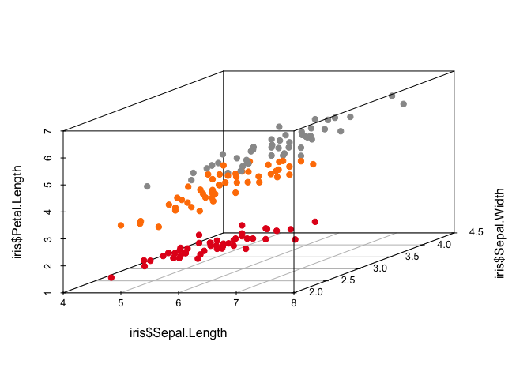
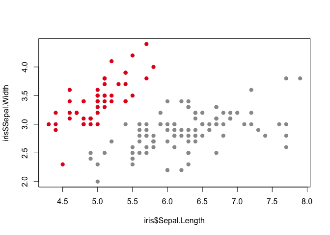

Exploring the iris dataset using R
================

In a recent blog post I used Python to explore the iris dataset. This is an attempt to produce the same output, but using R.

Loading the dataset and an initial look at the data
---------------------------------------------------

``` r
# Read in data
iris <- read.csv(url("http://archive.ics.uci.edu/ml/machine-learning-databases/iris/iris.data"), header = FALSE) 

# Add column names
names(iris) <- c("Sepal.Length", "Sepal.Width", "Petal.Length", "Petal.Width", "Species")

# We have data on 150 iris flowers and 4 different features
head(iris)
```

    ##   Sepal.Length Sepal.Width Petal.Length Petal.Width     Species
    ## 1          5.1         3.5          1.4         0.2 Iris-setosa
    ## 2          4.9         3.0          1.4         0.2 Iris-setosa
    ## 3          4.7         3.2          1.3         0.2 Iris-setosa
    ## 4          4.6         3.1          1.5         0.2 Iris-setosa
    ## 5          5.0         3.6          1.4         0.2 Iris-setosa
    ## 6          5.4         3.9          1.7         0.4 Iris-setosa

``` r
dim(iris)
```

    ## [1] 150   5

``` r
summary(iris)
```

    ##   Sepal.Length    Sepal.Width     Petal.Length    Petal.Width   
    ##  Min.   :4.300   Min.   :2.000   Min.   :1.000   Min.   :0.100  
    ##  1st Qu.:5.100   1st Qu.:2.800   1st Qu.:1.600   1st Qu.:0.300  
    ##  Median :5.800   Median :3.000   Median :4.350   Median :1.300  
    ##  Mean   :5.843   Mean   :3.054   Mean   :3.759   Mean   :1.199  
    ##  3rd Qu.:6.400   3rd Qu.:3.300   3rd Qu.:5.100   3rd Qu.:1.800  
    ##  Max.   :7.900   Max.   :4.400   Max.   :6.900   Max.   :2.500  
    ##             Species  
    ##  Iris-setosa    :50  
    ##  Iris-versicolor:50  
    ##  Iris-virginica :50  
    ##                      
    ##                      
    ## 

``` r
table(iris$Species)
```

    ## 
    ##     Iris-setosa Iris-versicolor  Iris-virginica 
    ##              50              50              50

``` r
str(iris)
```

    ## 'data.frame':    150 obs. of  5 variables:
    ##  $ Sepal.Length: num  5.1 4.9 4.7 4.6 5 5.4 4.6 5 4.4 4.9 ...
    ##  $ Sepal.Width : num  3.5 3 3.2 3.1 3.6 3.9 3.4 3.4 2.9 3.1 ...
    ##  $ Petal.Length: num  1.4 1.4 1.3 1.5 1.4 1.7 1.4 1.5 1.4 1.5 ...
    ##  $ Petal.Width : num  0.2 0.2 0.2 0.2 0.2 0.4 0.3 0.2 0.2 0.1 ...
    ##  $ Species     : Factor w/ 3 levels "Iris-setosa",..: 1 1 1 1 1 1 1 1 1 1 ...

``` r
names(iris)
```

    ## [1] "Sepal.Length" "Sepal.Width"  "Petal.Length" "Petal.Width" 
    ## [5] "Species"

``` r
hist(iris$Sepal.Length)
```


Create a scatter plot
---------------------

Let’s look at a scatter plot of the first 2 features (sepal length and sepal width).

These are some available colour palettes:

``` r
library(RColorBrewer)
display.brewer.all()
```


Choose some colours and make a plot:

``` r
cols=brewer.pal(n=9,name="Set1")
cols_palette = c(cols[1], cols[5], cols[9])
cols_iris <- cols_palette[iris$Species]
plot(iris$Sepal.Length, iris$Sepal.Width, col=cols_iris, pch=19)
```


Plotting a scatter matrix:

``` r
pairs(iris[,1:4], col=cols_iris)
```


A 3D plot of the first 3 features:

``` r
library(scatterplot3d)
scatterplot3d(iris$Sepal.Length, iris$Sepal.Width, iris$Petal.Length, color = cols_iris, pch = 19)
```



Try collecting Virginica and Versicolor together as they do not appear linearly separable.

``` r
# Copy the Species column to a new column Collapsed_species
iris$Collapsed_species <- iris$Species

# Add a new level to the factor
levels(iris$Collapsed_species) <- c(levels(iris$Collapsed_species), "Virginica-or-Versicolor")

# Collapse the species levels into Collapsed_species
iris$Collapsed_species[iris$Species %in% c("Iris-virginica","Iris-versicolor")] <-"Virginica-or-Versicolor"
```

Plot the data again to check that transformation worked as expected:

``` r
cols=brewer.pal(n=9,name="Set1")
cols_palette_2 = c(cols[1], 0, 0, cols[9])
cols_collapsed_iris <- cols_palette_2[iris$Collapsed_species]
plot(iris$Sepal.Length, iris$Sepal.Width, col=cols_collapsed_iris, pch=19)
```


